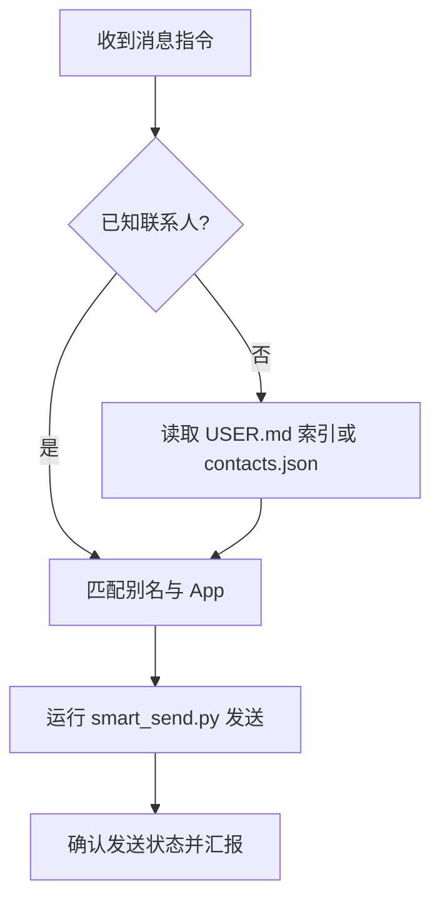

# 桌面消息自动化 (Desktop Messenger) 🐈

此技能旨在让 Nanobot 具备原生级别的 macOS 消息处理能力，通过调用底层自动化脚本，实现与微信、Telegram 等联系人的高效触达。

## 💡 核心逻辑 (Core Logic)

为了确保执行成功，请遵循以下闭环路径：



## 🛠️ 指令库 (Command Library)

### 1. 发送消息 (Send Message)
使用 `smart_send.py` 进行自动化发送,支持单个和批量模式。

**单个联系人:**
```bash
python3 scripts/smart_send.py "别名" "消息内容"
```

**批量发送(所有联系人):**
```bash
python3 scripts/smart_send.py --all "消息内容"
```

**批量发送(筛选 App):**
```bash
# 只给 Telegram 联系人发送
python3 scripts/smart_send.py --all "消息内容" --app Telegram
```

**使用特定账号:**
```bash
python3 scripts/smart_send.py --all "消息内容" --account "小李"
```

### 2. 获取/管理通讯录 (Contact Management)
读取或修改本地 `contacts.json` 数据库。
```bash
# 列出所有已存联系人(首选步骤)
python3 scripts/manage_contacts.py list

# 新增联系人映射
python3 scripts/manage_contacts.py add "别名" "App内实名" WeChat/Telegram
```

## 📂 数据架构 (Data Architecture)

- **核心数据库**: `scripts/contacts.json` (记录别名与 App 的映射关系)。
- **路径索引**: 详细的数据位置已在 `USER.md` 的 **## 📂 数据索引** 中建立常驻链接。

---
> [!TIP]
> **秘书建议**：
> - **群发任务**: 使用 `--all` 参数一次性发送给所有联系人,避免重复打开/关闭应用。
> - **精准发送**: 在群发前运行 `manage_contacts.py list` 确认所有联系人别名正确录入。🐾
