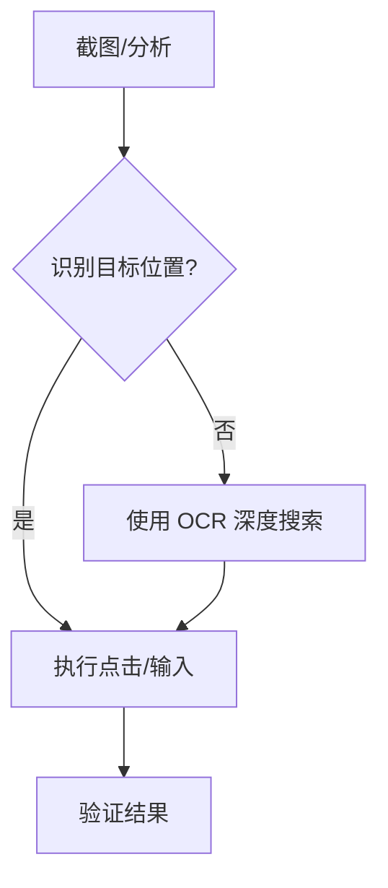

# 计算机通用控制 (Computer Control) 

该技能赋予 Nanobot 跨应用程序的通用操控能力，不局限于特定软件，实现“手”与“眼”的全局协同。

## 💡 核心组件 (Core Components)

1.  **视觉感知 (Vision)**: 使用 `mac_vision` 工具进行截图、OCR 识别及图标定位。
2.  **模拟输入 (Input)**: 使用 `mac` 相关工具模拟键盘点击 (`keystroke`)、鼠标位置 (`click`)、滚动 (`scroll`) 等。
3.  **应用管理 (App Management)**: 启动/激活应用程序、切换窗口及获取系统状态。

## 🛠️ 操作指南 (Operational Guide)

### 1. 屏幕交互流程

### 2. 常用操作示例
- **输入与快捷键**: 使用 `mac` 工具发送序列。
- **窗口调度**: 查找特定 App 的窗口并将其置于顶层。
- **页面分析**: 针对网页或客户端界面进行视觉布局分析。

## 📂 应用场景 (Use Cases)

- **跨软件流程**: 例如从 Excel 读取数据并输入到自定义的 ERP 网页。
- **GUI 自动化**: 针对没有 API 接口的遗留软件进行自动化操控。
- **动态排障**: 通过视觉反馈判断程序是否由于弹窗或加载失败而阻塞。

---
> [!IMPORTANT]
> **秘书准则**：作为通用控制者，在执行高危模拟点击前，优先使用视觉验证确保目标元素处于预期位置。
